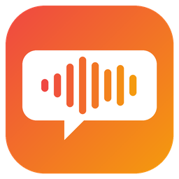
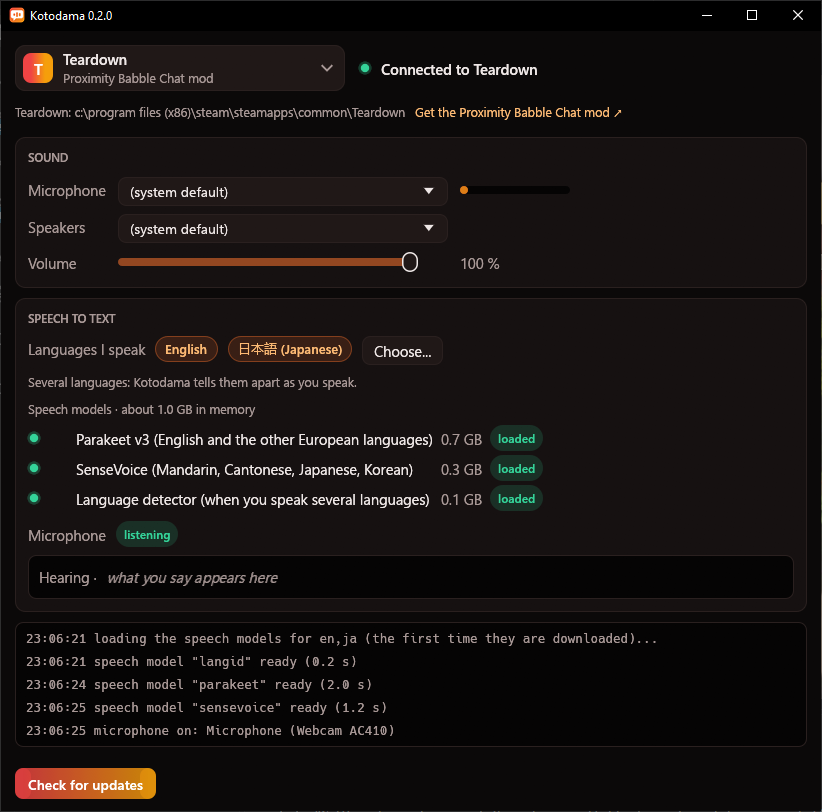

<p align="center">
  
</p>

<h1 align="center">Kotodama</h1>

<p align="center">
  <b>Proximity voice chat with live speech-to-text, for game mods.</b><br>
  Hear other players where they stand. Your words appear in the game as you say them.
</p>

<p align="center">
  <a href="https://github.com/AgeOfAlgorithms/kotodama/releases/latest/download/Kotodama-Setup.exe"></a>
  &nbsp;
  <a href="https://github.com/AgeOfAlgorithms/kotodama/releases/latest/download/Kotodama-linux.tar.gz"></a>
</p>

<p align="center">
  <a href="https://github.com/AgeOfAlgorithms/kotodama/releases"></a>
  <a href="https://github.com/AgeOfAlgorithms/kotodama/actions/workflows/build.yml"></a>
  
  <a href="LICENSE"></a>
</p>

<p align="center">
  
</p>

Kotodama ("word spirit" in Japanese) runs next to your game. It plays the other players' voices placed where they
stand: louder when close, muffled behind walls. It also writes what you say as you say it, so the
game can show your words in text to other players. By extension, your game or mod gains speech recognition capability, which easily lets you build speech-activated events in the game.

**What kind of mods can I build with Kotodama?**
- Proximity voice chat in a game that never had voice chat before.
- Seamless voice vs text communication between Kotodama users and players without Kotodama.
- A multiplayer chat history that records spoken words into multilingual text.
- A door that opens when a player verbally says "open sesame".
- A wand that shoots out a variety of magic spells on specific voice commands.

**Speech to text runs on your own PC**, and no account is needed. Your voice reaches the other players through a
small relay server, end-to-end encrypted with a key only the players in your game session have: the relay passes on
bytes it cannot listen to, and only to the players close enough to hear you.

> **Status:** early prototype, version 0.3. See [What's new](#whats-new).

## Highlights

- **Real voice chat.** Hear the other players where they stand: the game sets each voice's volume, direction and
  muffling. Only the players in range get your voice, and a whisper stays private.
- **Push to talk or always on.** Hold the game's talk key, or let Kotodama hear when you speak.
- **Live words.** Your line appears while you talk and is finished when you stop. Words already shown never jump back.
- **Many languages.** 14 fully supported, 8 in beta, 7 experimental. Speak several and mix them in one line.
- **Fair proximity.** Each word carries the time it was said, so a player who walks up mid-sentence sees only what
  they could have heard.
- **Light on your PC.** Only the speech models for your languages load: about 0.9 GB of memory for one language, up
  to 1.5 GB for several. It runs on the CPU, below the game's priority, and stays idle while you are silent.
- **Any game with a mod.** Games connect through small profile files, not plugins: anyone can add one.

## What's new

### 0.3.0: real voice chat

You can now hear the other players, not just their words. Your voice goes to the players close enough to hear you,
through a small relay server, encrypted end to end.

- **Real voices.** Kotodama sends your voice (Opus, about 3 KB/s while you talk) to the players in range of your
  speaking mode, and plays theirs where they stand. Whispers reach only the players near you.
- **Push to talk.** Hold the game's talk key to talk (the Teardown mod: B, rebindable), or choose always on. The
  first syllable is not cut off, and a line ends a quarter second after you let go.
- **Voice rooms.** Each game session gets its own room and key, made by Kotodama from your PC's secure random
  numbers. The host can choose the region the room lives in (Auto: near the first player to join).
- **Status for the game.** Kotodama tells the game which feed versions it reads, so a mod can ask an outdated
  Kotodama to update, and whether the voice server can be reached.
- **Self-test** now also sends a packet through the voice relay.

### 0.2.0: the Rust app

A rewrite of the whole app in Rust: a smaller download, no Python, and a window that works on any PC.

- **Languages I speak.** Tick the languages you speak; only their speech models load (about 0.9 GB of memory for
  one language). The list shows which languages are fully supported, in beta or experimental.
- **Game mod profiles.** Games connect through profile files anyone can write (files or a local socket), added from
  the window after a safety preview. Mods can use voices, speech to text, or both.
- **A smaller language detector:** 43 MB instead of 86, with the same results.
- **The Ember look:** a dark theme, the voice-wave icon, and an installer to match.

### 0.1.0: the first version

The first app, in Python, made for Teardown's Proximity Babble Chat mod: a window with a game picker, live words
while you talk and the finished line when you stop, word times so a player who walks up mid-sentence sees only what
they heard, test voices placed around you in the game, and a Windows installer with an updater.

## Install

**Windows:** download [`Kotodama-Setup.exe`](https://github.com/AgeOfAlgorithms/kotodama/releases/latest/download/Kotodama-Setup.exe)
(always the newest version; every version is on [Releases](https://github.com/AgeOfAlgorithms/kotodama/releases)) and run it. It installs for
your user only, with no administrator rights. Then start Kotodama, pick your game mod and start the game.

**Linux / Steam Deck:** download [`Kotodama-linux.tar.gz`](https://github.com/AgeOfAlgorithms/kotodama/releases/latest/download/Kotodama-linux.tar.gz), unpack it and run `Kotodama/Kotodama`. Games
running through Proton are found inside their Proton folder.

The first time you speak, Kotodama downloads the speech model for your language once, showing its progress:

| Model | Languages | Download |
|---|---|---|
| Parakeet v3 | English and the other European languages | 670 MB |
| GigaAM v3 | Russian | 225 MB |
| SenseVoice | Mandarin, Cantonese, Japanese, Korean | 240 MB |

**Updates:** the window's **Check for updates** installs a new version and restarts Kotodama. Uninstalling keeps your
settings and models in `%LOCALAPPDATA%\Kotodama`; delete that folder to remove them too.

## Game mods

| Game | Mod | Uses |
|---|---|---|
| Teardown | [Proximity Babble Chat](https://steamcommunity.com/sharedfiles/filedetails/?id=3812301496) | voices and speech to text |

**Adding a game:** a mod made for Kotodama comes with a small profile file (`.json`). In the window, open the game
mod list and choose **Add game mod...**. Kotodama shows what the profile reads, writes and listens on before adding
it. A profile is not a program: it only points Kotodama's built-in connectors at a game's files or at a local port,
and it can ask for voices, speech to text, or both.

**Making a mod for Kotodama:** see [PROTOCOL.md](PROTOCOL.md) for the profile format and the two connectors (files,
or a local socket), with an example profile and test client in [`examples/`](examples/).

## Languages

Open **Languages I speak → Choose...** and tick every language you speak. Fewer languages are lighter and more
accurate. With several, Kotodama tells them apart as you speak, choosing only among yours. Until you choose, it
follows the game's own language setting.

| Support | Languages |
|---|---|
| **Fully supported** | English, Spanish, French, German, Italian, Portuguese, Dutch, Polish, Ukrainian, Russian, Mandarin, Cantonese, Japanese, Korean |
| **Beta** (less accurate) | Czech, Slovak, Romanian, Croatian, Bulgarian, Finnish, Swedish, Hungarian |
| **Experimental** (many words come out wrong) | Danish, Estonian, Latvian, Lithuanian, Slovenian, Greek, Maltese |

## How it works

| Part | How |
|---|---|
| Voices | Your voice is compressed (Opus, 24 kbit/s), encrypted (ChaCha20-Poly1305) and sent through the relay, a Cloudflare Worker ([`relay/`](relay/)), to the players in range. The game sends each speaker's volume, direction and muffle; Kotodama mixes them in stereo, low-passed behind walls. |
| Speech detection | Silero VAD v5 finds where a line starts and ends. |
| Speech to text | The line so far is transcribed again every second; only words two passes agree on are shown. One more pass when you stop gives the finished line. |
| Language detection | SpeechBrain's VoxLingua107 detector splits a mixed-language line into stretches, each written by its language's model. |
| Engine | [sherpa-onnx](https://github.com/k2-fsa/sherpa-onnx) and ONNX Runtime, on the CPU. |

## For developers

Kotodama is a Rust program in [`app/`](app/), split into small crates ([`app/DESIGN.md`](app/DESIGN.md)). It needs
stable Rust, and on Windows the MSVC build tools.

```sh
cd app
cargo run -p kotodama                     # the window
cargo run -p kotodama -- --cli --help     # the command line, with test modes (no microphone needed)
cargo test --workspace                    # every part against the Python reference's answers
python build.py                           # dist/Kotodama/ and, with Inno Setup 6, the Windows installer
```

- The language detector is built once with `python engine/export_lid.py` (torch, speechbrain and onnx).
- The first version was Python ([`engine/`](engine/)). It stays as the reference the Rust tests compare against, and
  [`bench/`](bench/) holds the benchmarks behind every model choice.
- `Kotodama --selftest` checks a build's native parts. CI runs it on every build, and on Windows also installs,
  tests and uninstalls the installer.

## License

MIT, see [LICENSE](LICENSE). The models and libraries Kotodama uses are listed with their licenses in
[THIRD_PARTY_NOTICES.txt](THIRD_PARTY_NOTICES.txt).
